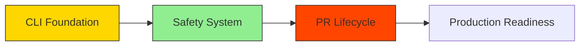

# Project TODOs and Improvements

## Status Legend
🟢 Complete
🟡 In Progress
🔴 Not Started
⚠️ Blocker

## Critical Path Analysis

### Current Blockers ⚠️
1. **Response Parsing for AI Outputs** (Milestone 1)
   - Blocking safety checks validation
   - Required for: AI content validation, diff verification
   - Dependencies: DeepSeek API integration ✅
   - Next Steps:
     - Implement Zod schema for response validation
     - Add error recovery for malformed responses
     - Implement retry logic for failed parses

2. **Email Notifications** (Milestone 2)
   - Blocking comprehensive security alerts
   - Required for: Complete notification system
   - Dependencies: Notification manager ✅
   - Next Steps:
     - Implement email service integration
     - Create HTML email templates
     - Add delivery retry logic

### Dependency Chain


## Project Milestones & Tasks

### Milestone 1: Basic CLI Foundation (v0.1.0) 🟡
- 🟢 Implement configuration loading
- 🟢 Set up GitHub API integration
- 🟢 Implement DeepSeek API integration
- 🟢 Add credential management system
- 🟢 Implement repository context caching
- ⚠️ Add response parsing for AI outputs
  - [ ] Implement Zod validation schema
  - [ ] Add response transformation pipeline
  - [ ] Implement error recovery strategies
- 🔴 Add repository owner/name retrieval from git config
- 🔴 Implement basic CLI interface

### Milestone 2: Safety System (v0.2.0) 🟢
- 🟢 Implement secure credential vault with encryption
- 🟢 Add namespace isolation for secrets
- 🟢 Integrate GitGuardian for secret scanning
  - ✅ Implement GGShield integration
  - ✅ Add configuration management
  - ✅ Add pre-commit/pre-push hooks
  - ✅ Implement Slack notifications
  - [ ] Implement email notifications
  - [ ] Add custom secret patterns
  - [ ] Configure policy enforcement
- 🟡 Add license compliance checking
- 🔴 Implement code quality analysis
- 🔴 Add security vulnerability scanning
- 🔴 Implement rate limiting with exponential backoff

### Milestone 3: Full PR Lifecycle (v0.3.0) 🔴
- 🔴 Implement branch management
- 🔴 Add atomic file operations
- 🔴 Implement PR creation and updates
- 🔴 Add dry run mode
- 🔴 Implement PR review assignment
- 🔴 Add PR template support

## Urgent Security Actions

### 1. OAuth2 Device Flow Implementation
```typescript
interface OAuth2DeviceFlow {
  initiate(): Promise<{ verification_uri: string, user_code: string }>;
  poll(): Promise<{ access_token: string }>;
  revoke(): Promise<void>;
}

class GitHubDeviceFlow implements OAuth2DeviceFlow {
  private readonly clientId: string;
  private readonly scopes: string[];
  private pollInterval: number = 5000;
  private maxAttempts: number = 12;

  constructor(clientId: string, scopes: string[] = ['repo']) {
    this.clientId = clientId;
    this.scopes = scopes;
  }

  // Implementation details to follow...
}
```

### 2. Dependency Scanning Integration
```yaml
# To be added to .github/workflows/security.yml
name: Security Scanning
on: [push, pull_request]

jobs:
  security-checks:
    runs-on: ubuntu-latest
    steps:
      - uses: actions/checkout@v4
      
      - name: Dependency Scanning
        uses: shiftleft/scan-action@v2
        with:
          type: 'depscan'
          
      - name: SAST Scan
        uses: shiftleft/scan-action@v2
        with:
          type: 'credscan'
          
      - name: Upload Results
        uses: github/codeql-action/upload-sarif@v2
        with:
          sarif_file: reports/scan-results.sarif
```

## Recent Implementations

### Security Enhancements 🟢
- ✅ Implemented `CredentialVault` with AES-256-GCM encryption
- ✅ Added namespace isolation for different contexts
- ✅ Implemented secure memory-only storage
- ✅ Added comprehensive error handling
- ✅ Added support for both encrypted and unencrypted storage
- ✅ Implemented GitGuardian integration with API key management
- ✅ Added pre-commit and pre-push Git hooks
- ✅ Implemented Slack notifications for security violations

### Performance Optimizations 🟢
- ✅ Implemented `RepoContextCache` with LRU caching
- ✅ Added configurable cache size and TTL
- ✅ Implemented cache statistics tracking
- ✅ Added automatic cache invalidation
- ✅ Implemented thread-safe operations

### Testing Coverage 🟡
- ✅ Added unit tests for CredentialVault
- ✅ Added unit tests for RepoContextCache
- ✅ Added unit tests for GitGuardian manager
- ✅ Added unit tests for notification system
- 🔴 Need integration tests for components working together
- 🔴 Need performance benchmarks
- 🔴 Need security audit tests

## Backlog

### High Priority
1. ⚠️ Implement email notifications
   - Choose email service provider
   - Create HTML email templates
   - Implement retry mechanism
   - Add comprehensive testing
2. ⚠️ Add comprehensive documentation
   - Create detailed README
   - Document configuration options
   - Add usage examples
   - Include troubleshooting guide
3. ⚠️ Set up CI/CD pipeline
   - Configure GitHub Actions
   - Add automated testing
   - Set up dependency scanning
   - Configure automated releases

### Medium Priority
1. Add telemetry and monitoring
2. Implement custom PR templates
3. Add support for multiple AI providers
4. Implement change preview in CLI

### Low Priority
1. Add support for custom hooks
2. Implement plugin system
3. Add interactive mode
4. Add support for custom formatters

## Technical Debt
1. Refactor error handling to be more consistent
2. Improve type safety across modules
3. Add more comprehensive documentation
4. Optimize memory usage in cache implementations

## Notes
- Security is a top priority - all credentials must be handled securely
- Performance optimizations should not compromise security
- Need to maintain backward compatibility
- Consider adding metrics collection for performance monitoring
- Regular security audits needed for dependencies
- Critical path items must be prioritized over feature development
- All security implementations must undergo peer review 