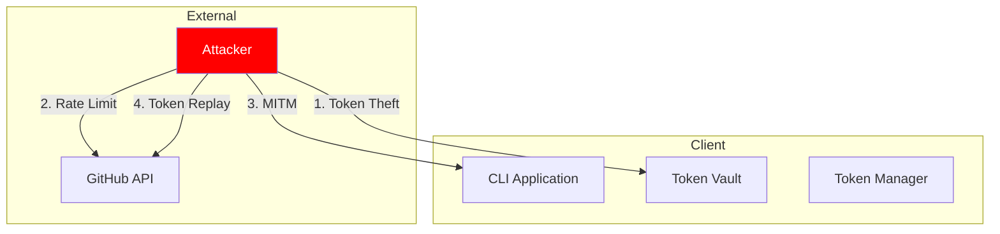

# Security Documentation

## Threat Model

### Authentication System


### Threat Scenarios

1. **Token Theft (T1)**
   - **Risk**: High
   - **Impact**: Unauthorized repository access
   - **Mitigations**:
     - Encrypted token storage
     - System keychain integration
     - Token scope limitations
     - Automatic token rotation

2. **Rate Limiting Attacks (T2)**
   - **Risk**: Medium
   - **Impact**: Service disruption
   - **Mitigations**:
     - Exponential backoff
     - Request queuing
     - Rate limit monitoring
     - IP-based restrictions

3. **Man-in-the-Middle (T3)**
   - **Risk**: Medium
   - **Impact**: Credential compromise
   - **Mitigations**:
     - TLS for all communications
     - Certificate pinning
     - Request signing
     - Response validation

4. **Token Replay (T4)**
   - **Risk**: Medium
   - **Impact**: Unauthorized operations
   - **Mitigations**:
     - Short token lifetimes
     - Token refresh validation
     - Activity monitoring
     - Revocation capabilities

## Security Controls

### 1. Authentication
- OAuth 2.0 Device Flow
- Secure token management
- Multi-factor authentication support
- Token scope enforcement

### 2. Authorization
- Principle of least privilege
- Role-based access control
- Resource-level permissions
- Action auditing

### 3. Data Protection
- At-rest encryption
- In-transit encryption (TLS 1.3)
- Secure credential storage
- Data minimization

### 4. API Security
- Rate limiting
- Request authentication
- Input validation
- Error handling

## Compliance Requirements

### SOC 2 Type II
1. **Security**
   - Access controls
   - Encryption standards
   - Security monitoring
   - Incident response

2. **Availability**
   - System monitoring
   - Backup procedures
   - Disaster recovery
   - Performance tracking

3. **Processing Integrity**
   - Data validation
   - Error handling
   - Quality assurance
   - Process monitoring

4. **Confidentiality**
   - Data classification
   - Access restrictions
   - Secure disposal
   - Encryption

### GDPR Compliance
1. **Data Protection**
   - Minimization
   - Encryption
   - Access controls
   - Retention policies

2. **User Rights**
   - Access requests
   - Data portability
   - Right to erasure
   - Consent management

3. **Documentation**
   - Processing records
   - Impact assessments
   - Breach procedures
   - Policy documentation

## Security Best Practices

### 1. Development
```yaml
# Security checks in CI/CD
steps:
  - name: Security scan
    run: |
      - SAST analysis
      - Dependency check
      - Secret detection
      - License compliance
```

### 2. Deployment
- Secure configuration management
- Environment separation
- Access control
- Monitoring and alerting

### 3. Operations
- Regular security updates
- Incident response plan
- Security training
- Audit logging

## Incident Response

### 1. Detection
- Security monitoring
- Alert triggers
- User reports
- Automated scanning

### 2. Response
- Incident classification
- Containment measures
- Investigation process
- Communication plan

### 3. Recovery
- Service restoration
- Data recovery
- Root cause analysis
- Prevention measures

### 4. Post-Incident
- Documentation
- Process improvement
- Training updates
- Control enhancement

## Security Roadmap

### Phase 1: Foundation
- [x] Basic authentication
- [x] Token management
- [x] Secure storage
- [ ] Audit logging

### Phase 2: Enhancement
- [ ] Advanced monitoring
- [ ] Automated response
- [ ] Compliance automation
- [ ] Security metrics

### Phase 3: Advanced
- [ ] AI-powered detection
- [ ] Zero-trust architecture
- [ ] Automated compliance
- [ ] Real-time protection 