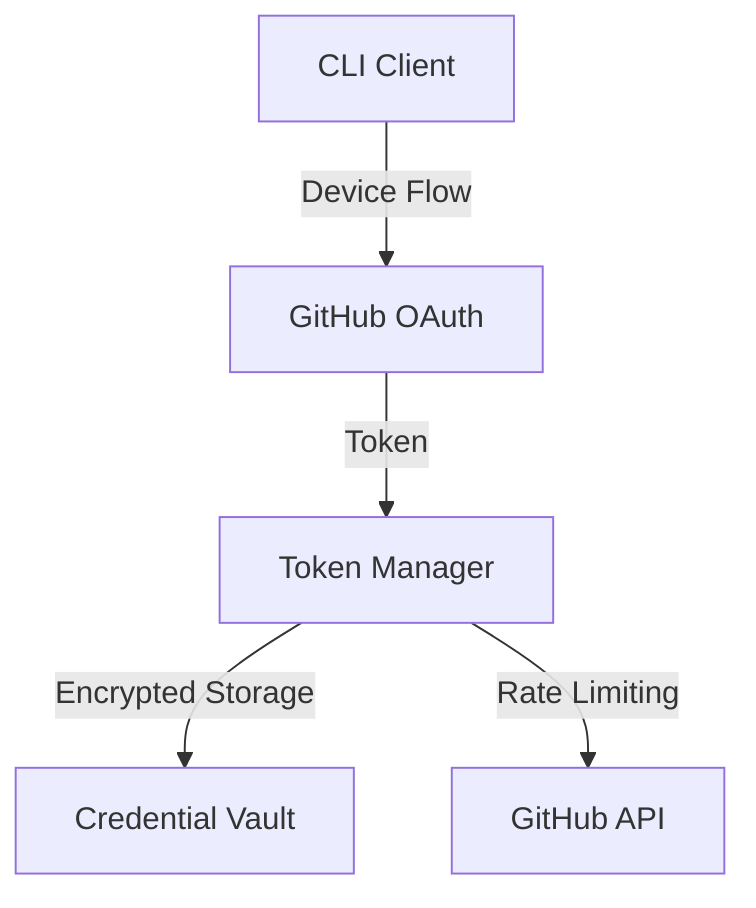
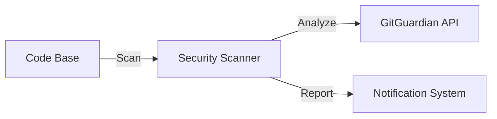
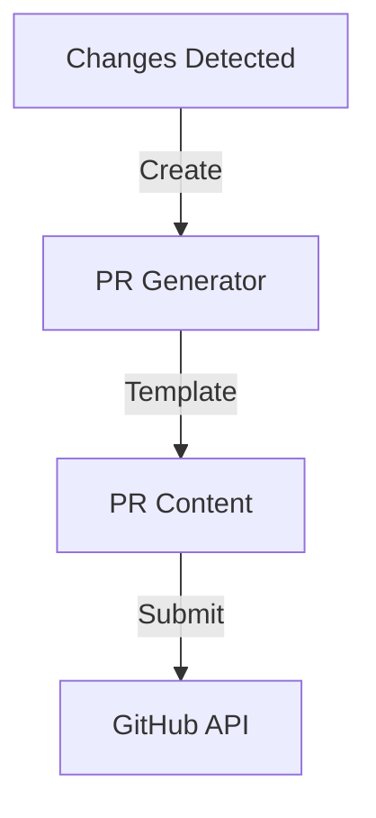

# Architecture Documentation

## System Overview

The Automate PR system is built with a modular architecture focusing on security, scalability, and maintainability. This document outlines the core architectural decisions and components.

## Core Components

### 1. Authentication System


- **Device Flow**: Implements OAuth 2.0 device authorization flow
- **Token Manager**: Handles token lifecycle, refresh, and rate limiting
- **Credential Vault**: Secure storage for sensitive credentials

### 2. Security Scanner


### 3. Pull Request Automation


## Data Flow

1. **Authentication Flow**
   - User initiates login via CLI
   - Device flow authentication with GitHub
   - Secure token storage and management
   - Automatic token refresh and rate limiting

2. **Scanning Flow**
   - Repository content analysis
   - Secret detection and validation
   - Real-time security alerts
   - Automated fix suggestions

3. **PR Creation Flow**
   - Change detection
   - Template selection
   - Content generation
   - PR submission and tracking

## Security Considerations

1. **Token Security**
   - Encrypted storage using system keychain
   - Automatic token rotation
   - Scope-limited access tokens
   - Rate limiting protection

2. **API Security**
   - TLS for all communications
   - Request signing
   - Rate limiting
   - Error handling with security in mind

## Configuration Management

```yaml
# Example configuration structure
github:
  clientId: string
  scopes: string[]
  rateLimit:
    maxRetries: number
    backoffDelay: number

security:
  scanners:
    - gitguardian
    - custom
  notifications:
    - email
    - slack
```

## Error Handling

1. **Authentication Errors**
   - Token expiration
   - Invalid credentials
   - Rate limiting
   - Network issues

2. **Scanning Errors**
   - API failures
   - Parse errors
   - Timeout handling
   - Resource constraints

## Monitoring and Logging

1. **Performance Metrics**
   - API response times
   - Token refresh operations
   - Scan durations
   - Error rates

2. **Audit Logs**
   - Authentication events
   - Security scan results
   - PR creation activities
   - Configuration changes

## Development Guidelines

1. **Code Organization**
   ```
   packages/
   ├── core/          # Core functionality
   ├── security/      # Security features
   ├── github/        # GitHub integration
   └── cli/           # Command line interface
   ```

2. **Testing Strategy**
   - Unit tests for core components
   - Integration tests for API interactions
   - End-to-end tests for CLI commands
   - Security testing for auth flows

## Future Considerations

1. **Scalability**
   - Parallel scanning
   - Distributed token management
   - Caching strategies

2. **Integration**
   - Additional security scanners
   - CI/CD pipeline integration
   - Custom notification channels 